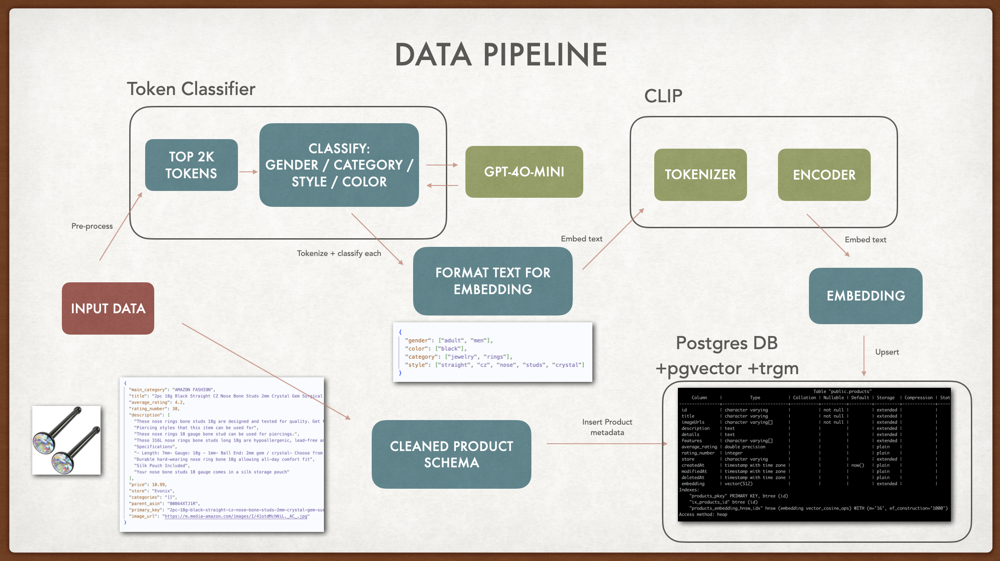

# 🌟 Fashion Assistant

Welcome to your fashion assistant! File structure:

1. `frontend` - lightweight frontend built using React + Tailwind
2. `api` - microservice with FastAPI + SQLAlchemy
3. `data_processing` - Jupyter Notebooks + additional analysis

## Getting Started

### Pre-Requisites

- Docker (for db)
- npm

### Frontend

```
cd frontend
npm install
npm run dev
```

### API

```
cd api
python -m venv venv
source venv/bin/activate
pip install -r requirements.txt
```

First, you'll need to spin up and seed the database. We've provided a JSON with 100 sample items. The docker-compose.yml file provided will provision a Postgres database locally.

```
docker compose up -d
python -m app.seed
python -m app.upsert_embeddings
```

Now, start the server:

```
python -m uvicorn app.main:app --reload
```

## API Docs

### POST `/products/search`

This endpoint allows you to search for products using any English natural language query. For example, to search "I need a cute dress for the summer":

```
curl -X POST "http://localhost:8000/products/search?q\=I%20need%20a%20cute%20dress%20for%20summer"
-H "Content-Type: application/json"
```

Additionally, you can also pass in search preferences:

```
curl -X POST "http://localhost:8000/products/search?q=\=I%20need%20a%20cute%20dress%20for%20summer" \
-H "Content-Type: application/json" \
-d '{
"gender": "female",
"price": "luxury",
"styles": ["casual", "sporty"]
}'
```

**Parameters**:

- q (required, query parameter): The search term.
- preferences (optional, JSON body):
  - gender (string, e.g. "male" or "female"),
  - price (string, e.g. "budget", "mid-range", "luxury"),
  - styles (array of strings, e.g. ["casual", "formal"]).

**Response**:
The API returns a list of Product objects, as well as a `similarity` score. Schema details can be found in `api/app/models.py`. Sample Product:

```
{
  "id": "dokotoo-womens-high-waist-bell-bottom-jeans-zipper-fly-flared-denim-pants-with-pockets-brown-size-4-B0BDQTRDCN",
  "title": "Dokotoo Womens High Waist Bell Bottom Jeans Zipper Fly Flared Denim Pants with Pockets Brown Size 4",
  "imageUrls": [
    "https://m.media-amazon.com/images/I/31yShJhVRnL._AC_.jpg"
  ],
  "description": "A pair of high waisted pants",
  "details": "",
  "features": [],
  "average_rating": 3.6,
  "rating_number": 3,
  "store": "Dokotoo",
  "createdAt": "2025-04-13T21:57:31.785073+00",
  "modifiedAt": "2025-04-14T04:34:17.946943+00",
  "deletedAt": null,
  "embedding": <length 512 vector>
}
```

## How it works


Flow of the request:

- [Query parsing](https://github.com/zhang-lucy/openai-fashion-assistant/blob/main/api/app/parse_query.py): The natural language query is parsed into a JSON blob of `category` and `tags`, where category represents broader fashion categories like "dress", "shirts", etc. while tags are other miscellaneous styles such as "casual", "denim".
- [Query Formatting](https://github.com/zhang-lucy/openai-fashion-assistant/blob/main/api/app/search.py#L95) The enhanced query is parsed into standard format for embedding
- [Embedding](https://github.com/zhang-lucy/openai-fashion-assistant/blob/main/api/app/clip_embedder.py#L26) We use CLIP to match the embeddings, which match the format of our DB embeddings
- [Embedding Retrieval](https://github.com/zhang-lucy/openai-fashion-assistant/blob/main/api/app/search.py#L120) Retrieves embeddings using ANN search
- [Text Match Retrieval](https://github.com/zhang-lucy/openai-fashion-assistant/blob/main/api/app/search.py#L134)
- [De-dupe and Merge](https://github.com/zhang-lucy/openai-fashion-assistant/blob/main/api/app/search.py#L153)
- [Re-rank](https://github.com/zhang-lucy/openai-fashion-assistant/blob/main/api/app/search.py#L173C9-L173C25)

## Data Pipeline


